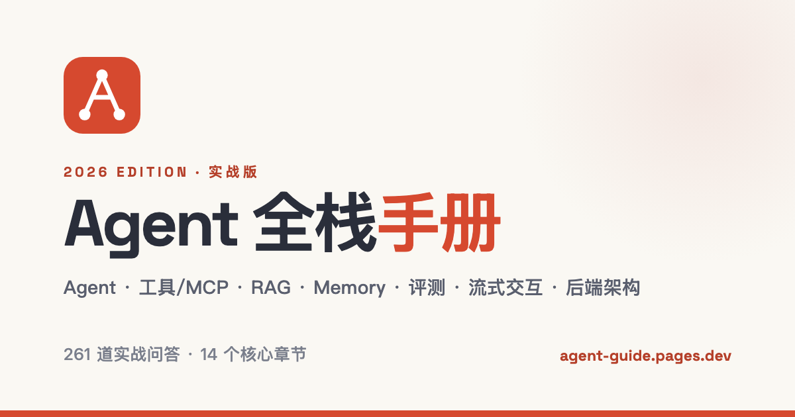

<div align="center">



# Agent 全栈手册

**AI Agent 全栈工程面试手册** —— 261 道题,每道都给出可口述、可追问的实战答案。

[**📖 在线阅读 →**](https://agent-guide-8js.pages.dev/)

</div>

---

## 这是什么

一份覆盖 **Agent 原理 · 工具/MCP · RAG · Memory · 评测 · 流式交互 · 后端架构 · 源码深挖** 的全栈面试题库。

和市面上「背定义」的题库不同,这里每道答案都按 **ChatGPT 式面试回答结构** 重写:

> **直接回答** —— 先给一句清晰结论,不绕定义
> **本题想考察什么** —— 点出面试官真正想验证的能力
> **回答例子** —— 给出可以直接口述的完整答案
> **过程中的技术点** —— 抽出落地步骤、参数和工程取舍
> **关键名词解释** —— 对 Prompt Injection、HITL、RAG、MCP 等特殊技术名词补充解释

既能 **60~90 秒口述**,又能被面试官 **追到代码与参数**。这套结构的目标是让答案先解决问题,再解释考点与技术名词,听起来像真实 ChatGPT 面试陪练,而不是念文档。

单文件、零构建、零依赖 —— 一个 `index.html`,浏览器打开即用,也可离线保存。

## 特性

- **261 道实战题 · 15 个核心章节** —— 从基础原理一路到生产深挖
- **ChatGPT 式回答结构** —— 先回答、再讲考点、示例、技术点与名词解释
- **真实参数与源码细节** —— `chunk 384 token`、`HNSW m=16`、`RRF k=60`、`max_steps=25`… 资深信号不靠形容词堆砌
- **约 100 个代码块** —— 伪代码 / SQL / Schema / 配置用 [marked](https://marked.js.org/) + [highlight.js](https://highlightjs.org/) 语法高亮渲染
- **亮色 / 暗色双主题** —— 顶栏一键切换,`localStorage` 记忆,代码高亮主题联动,防首屏闪烁
- **响应式** —— 桌面顶栏 + 居中单栏宽阅读,移动端横滑章节导航、无横向溢出
- **学习闭环** —— 全文搜索、按章跳转、标记「已掌握」、进度条,状态存本地

## 章节一览

| # | 章节 | 涵盖 |
|---|------|------|
| 01 | 项目深挖与技术选型 | 自我介绍 · 选型取舍 · 指标口径 · Ownership · 入职排障 |
| 02 | Agent 原理、编排与循环控制 | ReAct · 终止条件 · 循环检测 · Todo 外化 · HITL · Checkpoint |
| 03 | 工具调用、MCP 与安全 | Function Calling · Tool Schema · 权限 · Prompt Injection · 幂等 |
| 04 | RAG 数据、检索与生成 | 切片 · Embedding · Rerank · Hybrid · 召回排查 · 评测 |
| 05 | Context Engineering 与 Memory | 短/长期记忆 · 压缩 · 写入门槛 · 冲突 · 多租户隔离 |
| 06 | 评测、可观测与成本 | 成功率 · 轨迹评测 · Golden Set · LLM-Judge · Trace · 成本 |
| 07 | 流式交互与 Agent 前端 | SSE/WS · 事件协议 · 断线重连 · 停止生成 · Markdown 渲染 |
| 08 | 后端架构、数据与部署 | FastAPI 异步 · 任务队列 · 多租户 · Schema · 灰度 · 沙箱 |
| 09 | LLM 基础与编码题 | Transformer · 采样 · 幻觉 · 结构化输出 · 余弦相似度 · 异步池 |
| 10 | agent-server 源码深挖 | 唯一执行路径 · 两级压缩 · 软着陆 · 模型网关 · 工具 Pipeline |
| 11 | 生产深挖:流式输出 | 协议选型 · 断点续传 · 资源回收 · 内容安全 · 计费 · 压测 |
| 12 | 生产深挖:Agent 核心原理 | 执行环路 · 依赖管理 · 反思 · 调度限流 · 身份 · 回放 |
| 13 | 生产深挖:RAG 落地痛点 | 百万级延迟 · 实时一致性 · 多模态解析 · 增量索引 · 检索滞后 |
| 14 | 生产深挖:LLM 工程化与稳定性 | 推理调度 · 量化 · 熔断 · 成本安全 · 异步任务 · 高可用 · MLOps |
| 15 | 生产深挖:安全、成本与架构设计 | Prompt Injection · PII · Text2SQL · 知识库/客服/运维 Agent 设计 |

## 答案怎么读

建议先 **合上答案、看着题目自己口述一遍**,再展开核对要点与参数。不要逐字背诵 —— 答案里的「结合项目」部分基于作者真实经历(通用 Agent 平台、智能工单等),你应当替换成 **自己做过的方案**,把它当结构模板而非标准答案。涉及具体阈值、准确率、样本量时,以你自己的真实数据为准。

## 技术实现

- **纯静态单文件**:`index.html` 内联全部 CSS / JS,题库数据是 JS 里的 `chapters` 与 `productionDeepDive*` 数组,无打包、无框架、无后端。
- **渲染**:答案以 Markdown 存储,运行时用 `marked` 解析 + `highlight.js` 高亮(`atom-one-light` / `atom-one-dark` 随主题切换)。
- **排版**:Space Grotesk(拉丁 / 数字)+ 苹方(中文);配色用 OKLCH 感知均匀色彩,暖白纸底 + 石墨墨色 + 朱红主强调 + 靛蓝次强调。
- **Logo**:「由图节点构成的字母 A」,呼应 Agent 的图编排(LangGraph)与首字母。
- **主题**:`data-theme` 属性 + CSS 变量切换,`<head>` 内早执行脚本消除首屏闪烁。

## 目录结构

```
index.html             单文件应用(CSS + JS + 题库数据全内联)
favicon.svg            站点图标(节点-A logo)
apple-touch-icon.png   iOS 主屏图标(由 src/icon.html 渲染)
og.png                 社交分享卡片 1200×630(由 src/og.html 渲染)
src/                   OG / icon 的渲染源(.assetsignore 已排除,不部署)
.assetsignore          Cloudflare Pages 部署忽略清单
```

## 本地预览

```bash
python3 -m http.server 8080
# 打开 http://127.0.0.1:8080/
```

或直接用浏览器打开 `index.html`(代码高亮与字体需联网加载 CDN)。

## 部署(Cloudflare Pages)

```bash
npx wrangler pages deploy . --project-name agent-guide --branch main
```

`.assetsignore` 会自动排除 `src/`、`README.md` 等非站点文件。

## 重新生成 OG / icon

改完 `src/og.html` 或 `src/icon.html` 后,用无头浏览器按对应尺寸渲染截图:

```bash
python3 -m http.server 8080
#  OG : 视口 1200×630 截 src/og.html        → og.png
# icon: 视口 180×180  截 src/icon.html       → apple-touch-icon.png
```

## 许可

仅供个人学习与面试准备参考。答案中的项目指标、技术选型与实现细节,请以你自己的真实经历为准。
